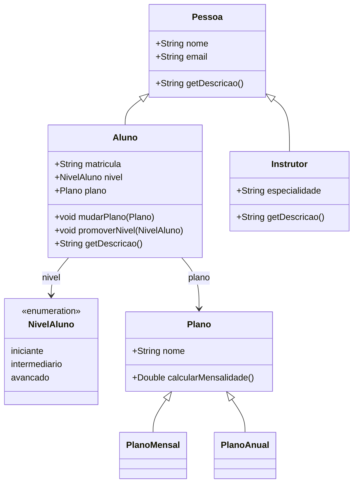
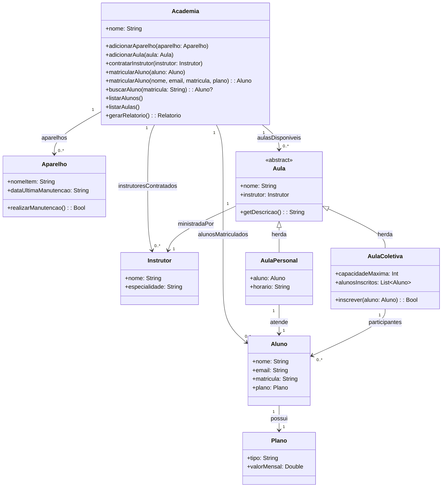

# openacademy-oop
Repository from the course OOP with Swift

### Diagrama 1 – Pessoas, Níveis e Planos

```mermaid
classDiagram
    direction TB

    class Pessoa {
        +String nome
        +String email
        +String getDescricao()
    }

    class Aluno {
        +String matricula
        +NivelAluno nivel
        +Plano plano
        +void mudarPlano(Plano)
        +void promoverNivel(NivelAluno)
        +String getDescricao()
    }

    class Instrutor {
        +String especialidade
        +String getDescricao()
    }

    class NivelAluno {
        <<enumeration>>
        iniciante
        intermediario
        avancado
    }

    class Plano {
        +String nome
        +Double calcularMensalidade()
    }

    class PlanoMensal
    class PlanoAnual

    Pessoa <|-- Aluno
    Pessoa <|-- Instrutor

    Plano <|-- PlanoMensal
    Plano <|-- PlanoAnual

    Aluno --> Plano : plano
    Aluno --> NivelAluno : nivel

```

---

```mermaid
classDiagram
    direction TB
    
    %% Classe Principal Academia
    class Academia {
        +nome: String
        +adicionarAparelho(aparelho: Aparelho)
        +adicionarAula(aula: Aula)
        +contratarInstrutor(instrutor: Instrutor)
        +matricularAluno(aluno: Aluno)
        +matricularAluno(nome, email, matricula, plano): Aluno
        +buscarAluno(matricula: String): Aluno?
        +listarAlunos()
        +listarAulas()
        +gerarRelatorio(): Relatorio
    }
    
    %% Classes de Pessoas
    class Aluno {
        +nome: String
        +email: String
        +matricula: String
        +plano: Plano
    }
    
    class Instrutor {
        +nome: String
        +especialidade: String
    }
    
    class Plano {
        +tipo: String
        +valorMensal: Double
    }
    
    %% Classes de Equipamento
    class Aparelho {
        +nomeItem: String
        +dataUltimaManutencao: String
        +realizarManutencao(): Bool
    }
    
    %% Classes de Aulas
    class Aula {
        <<abstract>>
        +nome: String
        +instrutor: Instrutor
        +getDescricao(): String
    }
    
    class AulaPersonal {
        +aluno: Aluno
        +horario: String
    }
    
    class AulaColetiva {
        +capacidadeMaxima: Int
        +alunosInscritos: List~Aluno~
        +inscrever(aluno: Aluno): Bool
    }
    
    %% Relacionamentos da Academia
    Academia "1" --> "0..*" Aluno : alunosMatriculados
    Academia "1" --> "0..*" Instrutor : instrutoresContratados
    Academia "1" --> "0..*" Aparelho : aparelhos
    Academia "1" --> "0..*" Aula : aulasDisponiveis
    
    %% Relacionamentos de Aluno
    Aluno "1" --> "1" Plano : possui
    
    %% Relacionamentos de Aulas
    Aula <|-- AulaPersonal : herda
    Aula <|-- AulaColetiva : herda
    
    Aula "1" --> "1" Instrutor : ministradaPor
    AulaPersonal "1" --> "1" Aluno : atende
    AulaColetiva "1" --> "0..*" Aluno : participantes
```